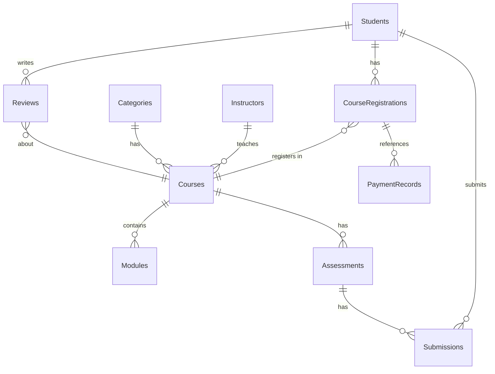

# LMS

## Cardinality

```mermaid
erDiagram
    Students ||--o{ CourseRegistrations : "has"
    CourseRegistrations }o--|| Courses : "registers in"

    Instructors ||--o{ Courses : "teaches"
    Categories ||--o{ Courses : "has"

    Courses ||--o{ Modules : "contains"
    Courses ||--o{ Assessments : "has"

    Students ||--o{ Submissions : "submits"
    Assessments ||--o{ Submissions : "has"

    CourseRegistrations ||--o{ PaymentRecords : "references"

    Students ||--o{ Reviews : "writes"
    Reviews }o--|| Courses : "about"
```