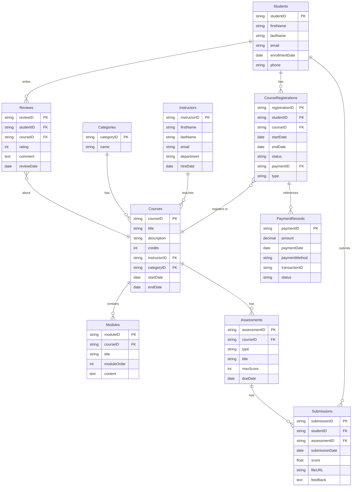

# LMS

## ERD with attributes for each ententies.

```mermaid
erDiagram
    %% Entity: Students
    Students {
        string studentID PK
        string firstName
        string lastName
        string email
        date enrollmentDate
        string phone
    }

    %% Entity: Instructors
    Instructors {
        string instructorID PK
        string firstName
        string lastName
        string email
        string department
        date hireDate
    }

    %% Entity: Categories
    Categories {
        string categoryID PK
        string name
    }

    %% Entity: Courses
    Courses {
        string courseID PK
        string title
        string description
        int credits
        string instructorID FK
        string categoryID FK
        date startDate
        date endDate
    }

    %% Entity: Modules
    Modules {
        string moduleID PK
        string courseID FK
        string title
        int moduleOrder
        text content
    }

    %% Entity: Assessments
    Assessments {
        string assessmentID PK
        string courseID FK
        string type
        string title
        int maxScore
        date dueDate
    }

    %% Entity: Submissions
    Submissions {
        string submissionID PK
        string studentID FK
        string assessmentID FK
        date submissionDate
        float score
        string fileURL
        text feedback
    }

    %% Entity: PaymentRecords
    PaymentRecords {
        string paymentID PK
        decimal amount
        date paymentDate
        string paymentMethod
        string transactionID
        string status
    }

    %% Entity: CourseRegistrations
    CourseRegistrations {
        string registrationID PK
        string studentID FK
        string courseID FK
        date startDate
        date endDate
        string status
        string paymentID FK
        string type
    }

    %% Entity: Reviews
    Reviews {
        string reviewID PK
        string studentID FK
        string courseID FK
        int rating
        text comment
        date reviewDate
    }

    %% Relationships %%

    Students ||--o{ CourseRegistrations : "has"
    CourseRegistrations }o--|| Courses : "registers in"

    Instructors ||--o{ Courses : "teaches"
    Categories ||--o{ Courses : "has"

    Courses ||--o{ Modules : "contains"
    Courses ||--o{ Assessments : "has"

    Students ||--o{ Submissions : "submits"
    Assessments ||--o{ Submissions : "has"

    CourseRegistrations ||--o{ PaymentRecords : "references"

    Students ||--o{ Reviews : "writes"
    Reviews }o--|| Courses : "about"
```